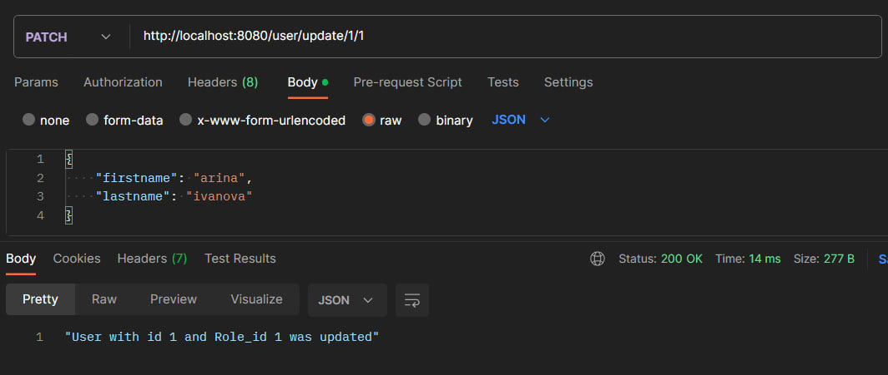

# Тестування працездатності системи

Тестування системи проводилось у IDE JetBrains IntelliJ IDEA за допомогою застосунку Postman

## Створення користувача
### Успішне створення

### Неуспішне створення користувача(не вказано id)

## Отримання всіх користувачів

## Отримання одного користувача
### Успішне отримання

## Рудагування користувачча
### Успішне редагування

### Неуспішне редагування

## Видалення користувачча
### Успішне видалення

### Неуспішне видалення
